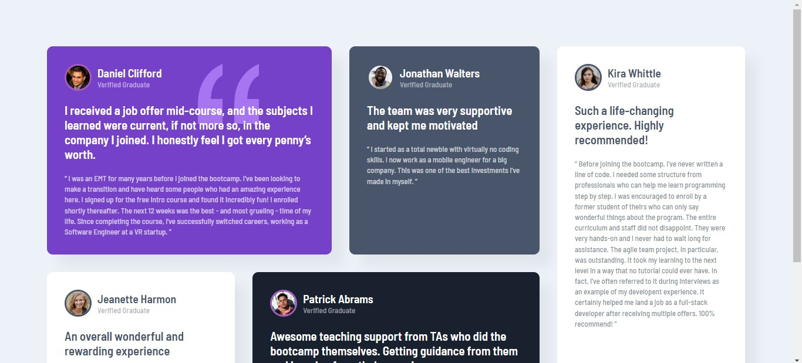

# Frontend Mentor - Testimonials grid section solution

Essa é minha solução para o [Desafio da seção de grade de depoimentos no Frontend Mentor](https://www.frontendmentor.io/challenges/testimonials-grid-section-Nnw6J7Un7). Os desafios do Frontend Mentor lhe ajudam a aprimorar habilidades de codificação construindo projetos realistas. 

## Tabela de conteúdos

- [Overview](#overview)
  - [O desafio](#o-desafio)
  - [Screenshot](#screenshot)
  - [Links](#links)
- [Meu progresso](#meu-progresso)
  - [Feito com](#feito-com)
  - [O que aprendi](#o-que-aprendi)
- [Autor](#autor)
- [Conhecimentos](#conhecimentos)

## Overview

### O desafio

Os usuários devem ser capazes de:

- Ver o layout ideal dependendo do tamanho da tela do dispositivo

### Screenshot



### Links

- Solution URL: [Solution](#)
- Live Site URL: [Live Site](#)

## Meu progresso

### Feito com

- Marcação HTML5 semântico 
- Propriedades personalizadas CSS
- Flexbox
- CSS Grid

### O que aprendi

Primeira vez usando CSS Grid! Ainda não sei muita coisa sobre isso e eu vou tentar melhorar nessas habilidades.

```css
grid-template-areas: 
  "card1 card1 card2 card5"
  "card3 card4 card4 card5";
```

## Autor

- Frontend Mentor - [@Gabriel-H502](https://www.frontendmentor.io/profile/Gabriel-H502)
- FreeCodeCamp - [@Gabriel-H502](https://www.freecodecamp.org/Gabriel-H502) 
- GitHub - [Gabriel-H502](https://github.com/Gabriel-H502)


## Conhecimentos

Usei IA para tirar minhas dúvidas APENAS. Esta seria [You.com](https://you.com/)