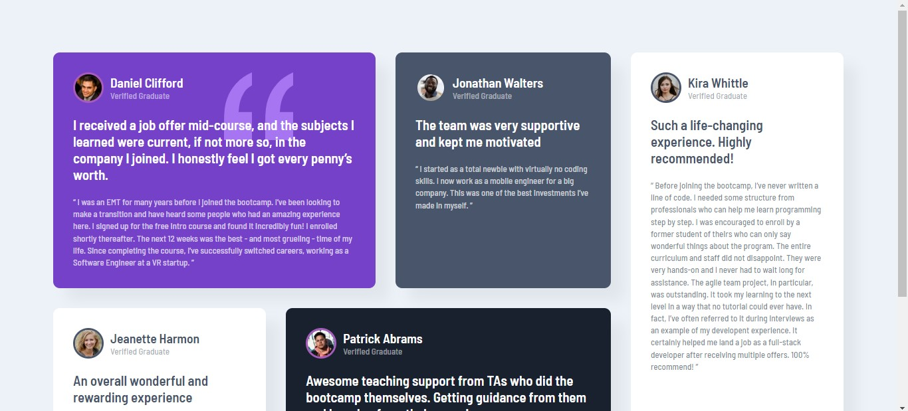

# Frontend Mentor - Testimonials grid section solution

This is a solution to the [Testimonials grid section challenge on Frontend Mentor](https://www.frontendmentor.io/challenges/testimonials-grid-section-Nnw6J7Un7). Frontend Mentor challenges help you improve your coding skills by building realistic projects. 

## Table of contents

- [Overview](#overview)
  - [The challenge](#the-challenge)
  - [Screenshot](#screenshot)
  - [Links](#links)
- [My process](#my-process)
  - [Built with](#built-with)
  - [What I learned](#what-i-learned)
- [Author](#author)
- [Acknowledgments](#acknowledgments)

## Overview

### The challenge

Users should be able to:

- View the optimal layout for the site depending on their device's screen size

### Screenshot



### Links

- Solution URL: [Add solution URL here](https://your-solution-url.com)
- Live Site URL: [Add live site URL here](https://your-live-site-url.com)

## My process

### Built with

- Semantic HTML5 markup
- CSS custom properties
- Flexbox
- CSS Grid

### What I learned

First time using CSS Grid! I still don't know much about it and I'll try to get better on these skills.

```css
grid-template-areas: 
  "card1 card1 card2 card5"
  "card3 card4 card4 card5";
```

## Author

- Frontend Mentor - [@Gabriel-H502](https://www.frontendmentor.io/profile/Gabriel-H502)
- FreeCodeCamp - [@Gabriel-H502](https://www.freecodecamp.org/Gabriel-H502) 
- GitHub - [Gabriel-H502](https://github.com/Gabriel-H502)


## Acknowledgments

I used AI to clear my doubts ONLY. This AI is [You.com](https://you.com/). 